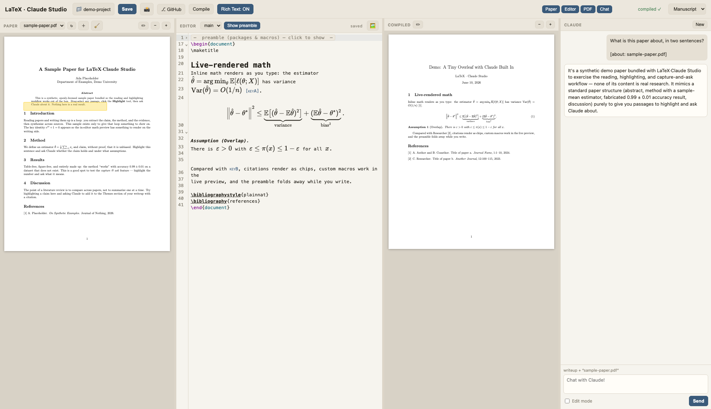
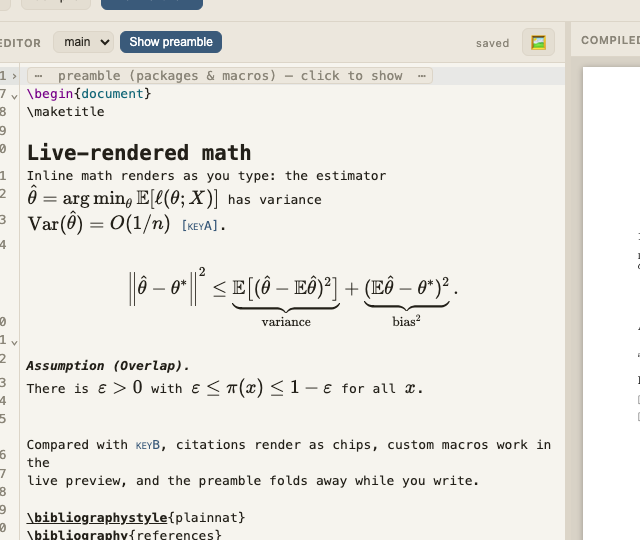
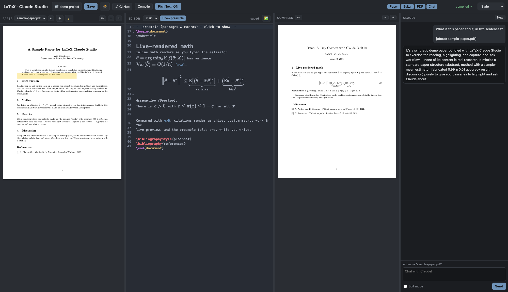

# LaTeX · Claude Studio

A tiny, local Overleaf-style workspace for **reading papers and writing them up**,
with Claude Code built in. Four resizable columns:
**paper PDF** (the source you're reading, far left) · **rich-text editor** ·
**compiled PDF** (your writeup) · **Claude chat**.

It deliberately reuses tools already on your Mac rather than bundling its own:

- **MacTeX** (`latexmk` + `bibtex`) compiles `project/main.tex` → PDF with citations
- the **`claude` CLI** powers the chat — it can **read the source PDFs** in
  `papers/` (the Read tool understands PDFs) and **edit** `main.tex` / `references.bib`
- a browser renders both PDFs natively

## What it looks like

The four panes: a paper you're reading (with a highlight), the editor, your
compiled writeup, and Claude (a real reply about the bundled sample paper):



The editor live-renders your LaTeX as you type — inline math, `align`
environments, theorem labels, citation chips, and **your own preamble macros**
(`\E`, `\argmin`, `\norm`, …), with the preamble folded out of the way. Click
any line to edit its raw source:



Three classic themes — warm *Manuscript* (above), neutral-dark *Slate* (below),
and crisp *B&W*:



## Requirements

- **Node 18+**
- A **LaTeX** install providing `latexmk` + `bibtex` (e.g. MacTeX / TeX Live)
- The **[Claude Code CLI](https://docs.claude.com/en/docs/claude-code)** (`claude`), logged in
- For the dock app: **Google Chrome**

## Install & run

```bash
git clone https://github.com/smrichardson/claude-latex-studio
cd claude-latex-studio
npm install

# Dev (hot reload): frontend on :4318, backend on :4319
npm run dev          # then open http://localhost:4318

# Or production (single port): build once, serve everything from :4319
npm run build && npm start   # then open http://localhost:4319
```

### Run it as a real Mac app (dock)

```bash
npm run build
scripts/build-native-app.sh        # → /Applications/LaTeX Claude Studio.app
```

This compiles a **native Swift/WKWebView app** (needs Xcode Command Line Tools —
`swiftc`). It has its own window and Dock icon, starts the studio server itself
if it isn't running, and supports file pickers and JS dialogs. Drag it to your
Dock; add it to **System Settings → Login Items** if you want it at startup.
(`scripts/make-macos-app.sh` still generates the older AppleScript/Chrome
launcher as a fallback.)

## Projects & folder structure

A project is a folder:

```
my-project/
  main.tex          your writeup
  references.bib    bibliography
  papers/           source PDFs (subfolders allowed, e.g. papers/readings/, papers/finds/)
  figures/          images for \includegraphics
```

The default is the repo's `project/`. Point at another with env vars:

```bash
STUDIO_PROJECT="/path/to/my-project" npm start      # open http://localhost:4319
STUDIO_MAIN="writeup.tex" STUDIO_PROJECT=... npm start   # if the main file isn't main.tex
```

Scaffold a fresh one with `scripts/new-project.sh <path>`. Papers are discovered
**recursively** under `papers/`, so you can organise them into subfolders.

Or just click **📁 project** in the toolbar — it opens the native macOS folder
chooser (press **⌘⇧G** inside it to type a path). The choice persists (to
`~/.latex-claude-studio.env`, which the dock app also reads).

**Git checkpoints (optional):** click **⎇ GitHub** in the toolbar to turn the
current project into a git repo with a **private** GitHub remote in one shot
(init + `.gitignore` + commit + `gh repo create --private --push`; needs the
`gh` CLI). From then on the studio auto-commits after every Claude edit
(message: `claude: <your prompt>`) and pushes in the background; **📸** commits
a manual snapshot anytime.

## Paper reading + writeup workflow

1. **Add papers.** Drop PDFs into `project/papers/` (subfolders fine), or click ＋ in the
   PAPER pane to upload. Hit ↻ to re-scan, then pick one from the dropdown to read it.
   - **🧹 Tidy names:** click the broom in the PAPER header to rename arXiv-numbered /
     cryptic PDFs (e.g. `2212.11254v1.pdf`) to readable *“Author Year - Title.pdf”* —
     Claude reads each one. Highlights follow the rename.
2. **Read with Claude.** With a paper selected, ask in the chat — e.g.
   *“Summarize this paper's method”* or *“What's the main contribution?”*. Claude opens
   the PDF (Read tool) and answers. The composer shows which paper is in context.
   - **Highlight & ask.** Click **✏︎** in the PAPER header, then drag a box over any
     passage. Hover a highlight for **💬** (discuss the cropped region — Claude reads the
     image) or **✕** (remove). Highlights persist per paper (`papers/.highlights.json`)
     and survive restarts.
   - **Zoom** each PDF with the **− / +** buttons in its header. The last-opened paper
     reopens automatically.
3. **Write it up.** Edit `main.tex` (the lit-review template) on the left; it autosaves
   and recompiles. Toggle **Rich Text** to see math/headings rendered inline.
   - **Insert images:** click **🖼** in the EDITOR header (or drag an image file onto the
     editor). It's saved to `project/figures/` and a `\includegraphics` figure block is
     inserted at the cursor — no manual file wrangling.
   - The template preamble ships with common **stats/ML packages and macros**
     (`mathtools`, `bm`, `booktabs`, `algorithm`, `cleveref`, theorem envs, and macros like
     `\E \Var \Cov \argmin \norm \indep \Normal \convd`). **Hide preamble** in the EDITOR
     header folds it away so you can focus on the body.
   - **Your custom macros render in the live preview too.** The rich-text view parses the
     `\newcommand`/`\DeclareMathOperator` definitions from your preamble and feeds them to
     KaTeX, so `$\E[X]$` shows as 𝔼[X] inline — define a new macro and it just works.
4. **Let Claude write.** Tick **Edit mode** and ask e.g.
   *“Add this paper to the Themes section with a citation, and add its BibTeX entry.”*
   Claude edits `main.tex` **and** `references.bib`; the editor reloads and recompiles.
   The chat **remembers the conversation** (so "now expand on that" works); hit **New**
   in the CLAUDE header to start fresh.

## Use

- Source autosaves (~0.7 s) and recompiles. **Save** (or `⌘/Ctrl+S`) saves + compiles now;
  **Compile** forces a rebuild. LaTeX errors surface in the Claude pane.
- **Pick the file to edit** from the dropdown in the EDITOR header — any `.tex` in the
  project (subfolders included). Edits/compile target the selected file; your choice is
  remembered.
- **Highlight the compiled PDF too:** click **✏︎** in the COMPILED header and drag to mark
  spots to revise (separate from SyncTeX click-to-source, which works when ✏︎ is off).
- **Rich Text: ON/OFF** toggles inline rendering of math, headings, bold/italic, bullets,
  **display-math environments** (`equation`/`align`/`gather`/`multline`), and **theorem-like
  environments** (`remark`/`assumption`/… shown as a bold label). Click a line (or anywhere
  in a multi-line block) to reveal its raw LaTeX for editing.
- Drag the column dividers to resize panes, or **hide whole panes** with the
  Paper / Editor / PDF / Chat toggles in the toolbar (persisted).
- **Enter** sends a chat message (Shift+Enter for a newline).
- **Rewind:** hover a chat message you sent and click **⏪** — the conversation,
  Claude's memory, *and the document* roll back to just before that message
  (every turn is checkpointed via `claude --fork-session` + a `.tex` snapshot),
  and your original prompt lands back in the composer to edit and resend.
- **Theme** picker (top-right): _Manuscript_ (warm paper), _Slate_ (neutral dark), or
  _B&W_ (crisp light). Your choice is remembered; `?theme=slate` also forces one.

## Files

| Path | What |
|------|------|
| `server.mjs` | Node backend: `/api/{file,compile,pdf,papers,paper,claude}` |
| `src/main.ts` | Frontend: editor, autosave→compile, papers, resizable panes, chat |
| `src/rich-text-preview.ts` | The CodeMirror live-preview (rich text) extension |
| `project/main.tex` | Your writeup (literature-review template) |
| `project/references.bib` | BibTeX bibliography (`\cite{}` keys live here) |
| `project/papers/` | Drop source paper PDFs here |
| `project/main.demo.tex.bak` | Backup of the original demo doc |

## SyncTeX (click compiled PDF → jump to source)

The compiled PDF is rendered with **pdf.js** (not a plain iframe) so clicks are
captured. Click anywhere in the COMPILED pane and the editor jumps to the matching
source line (with a brief highlight where you clicked). Powered by `latexmk -synctex=1`
+ the `synctex edit` CLI via `/api/synctex`.

## Notes

- **Rich text** now renders math, `\section*`, `\textbf/\textit/\emph`, `\item`,
  `itemize/enumerate` environments, `\citep/\citet` (as chips), and `\href/\url` (as
  links). Tables/figures still show as raw source — incremental additions in
  `rich-text-preview.ts`.
- pdf.js parses on the main thread (worker module registered on `globalThis`), so PDF
  rendering needs no network and no separate worker file.
- Claude edits run with `--permission-mode acceptEdits` scoped to `project/` — it can
  change `main.tex`, `references.bib`, and read `papers/`, but it's still the real
  Claude Code CLI using your existing login.

## Possible next steps

- Forward sync (cursor in editor → scroll/highlight the PDF).
- Render `tabular`/`figure` in rich text.
- Persist a session (open papers, scroll positions) across restarts.

## License & trademark note

MIT (see [LICENSE](LICENSE)).

This is an **unofficial, community-built tool** that drives your own
[Claude Code](https://docs.claude.com/en/docs/claude-code) installation — your
login, your machine, your files. It is not affiliated with, sponsored, or
endorsed by Anthropic. "Claude" is a trademark of Anthropic, PBC.
